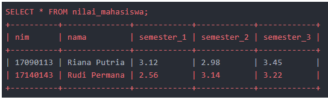
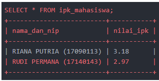
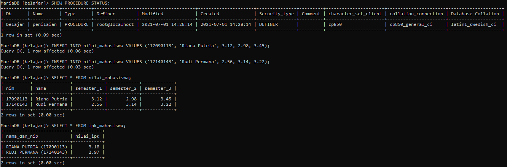

# Tugas_14_MySQL

### Berikut perintah untuk membuat tabel nilai_mahasiswa:

```mysql
DROP TABLE IF EXISTS nilai_mahasiswa;
```

```mysql
CREATE TABLE nilai_mahasiswa ( 
	nim CHAR(8) PRIMARY KEY, 
	nama VARCHAR(50), 
	semester_1 DECIMAL(4,2), 
	semester_2 DECIMAL(4,2), 
	semester_3 DECIMAL(4,2) 
);
```

### Aturan:
### 1. Ketika data mahasiswa diinput ke dalam tabel nilai_mahasiswa, buat sebuah trigger yang akan menghitung nilai IPK dari mahasiswa tersebut lalu simpan ke tabel baru.
### 2. Agar lebih menantang, selain nilai IPK, tampilkan juga kombinasi nama dan nim mahasiswa dengan format NAMA_MAHASISWA (nim) seperti RIANA PUTRIA (17090113). Nama mahasiswa ditulis menggunakan huruf besar.
### 3. Anda bebas untuk merancang tabel baru yang akan menampung nilai nama (nim) dan IPK ini. Sebagai contoh, misalkan saya input dua data berikut ke tabel nilai_mahasiswa:
```mysql
INSERT INTO nilai_mahasiswa VALUES ('17090113', 'Riana Putria', 3.12, 2.98, 3.45);
```

```mysql
INSERT INTO nilai_mahasiswa VALUES ('17140143', 'Rudi Permana', 2.56, 3.14, 3.22);
```

### Maka hasilnya adalah sebagai berikut:




### Sebagai **tips**, di dalamnya perlu menggunakan beberapa fungsi bawaan MySQL, seperti UPPER(), CONCAT() dan ROUND().

```mysql
DROP TABLE IF EXISTS ipk_mahasiswa;
```

```mysql
CREATE TABLE ipk_mahasiswa ( 
	nama_dan_nip VARCHAR(70) PRIMARY KEY, 
	nilai_ipk DECIMAL(4,2)
);
```

```mysql
DELIMITER $$
CREATE TRIGGER after_nilai_mahasiswa_insert 
AFTER INSERT ON nilai_mahasiswa 
FOR EACH ROW 
BEGIN 
	DECLARE nama_nim_mahasiswa VARCHAR(50); 
	DECLARE nilai_ipk DECIMAL(4,2); 

	SET nama_nim_mahasiswa = CONCAT(UPPER(NEW.nama)," (",NEW.nim,")"); 
	SET nilai_ipk = ROUND(((NEW.semester_1+NEW.semester_2+NEW.semester_3)/3),2); 
	INSERT INTO ipk_mahasiswa VALUES (nama_nim_mahasiswa, nilai_ipk); 
END$$ 
```


